# Multi-Product SaaS Platform

> A full-stack portfolio case study demonstrating how I designed and implemented a multilingual SaaS control plane and four domain-specific products: e-commerce, real estate, local delivery, and appointment management.

## Executive summary

I built this project to demonstrate end-to-end product engineering rather than a collection of disconnected interfaces. The system combines a central commercial platform with independently deployable products, each serving a different business domain while sharing common SaaS concerns such as authentication, authorization, localization, tenant isolation, subscriptions, provisioning, administration, and operational visibility.

My work spans product discovery, UX architecture, responsive frontend development, backend services, relational data modeling, role-based access control, multilingual and RTL support, transactional workflow design, demo/production boundaries, and deployment planning.

The result is an advanced portfolio prototype with a functional central MVP and several polished product demos. I do not present the complete ecosystem as production-ready. Instead, this case study documents what I implemented, the decisions behind it, the current maturity of each subsystem, and the work I would prioritize before a commercial launch.

### Project at a glance

| Area | Scope |
|---|---|
| Product model | One commercial hub managing four independently deployable products |
| Applications | Company Hub, Nova Market, KeyHaven, OpenDelivery, and Luxorius |
| User roles | Visitor, client, platform owner, store operator, property agent, courier, business, and appointment administrator |
| Languages | English, Arabic, and Hebrew, including right-to-left layouts |
| Frontend | React, Next.js, Vite, responsive web interfaces, and Capacitor mobile shells |
| Backend | Next.js server routes, Express services, Prisma, PostgreSQL-compatible persistence, and product-specific APIs |
| Cross-cutting concerns | Authentication, authorization, tenant scoping, subscriptions, provisioning, audit history, support, localization, and demo safety |
| Current stage | Functional SaaS hub plus domain MVPs and interactive product demonstrations |

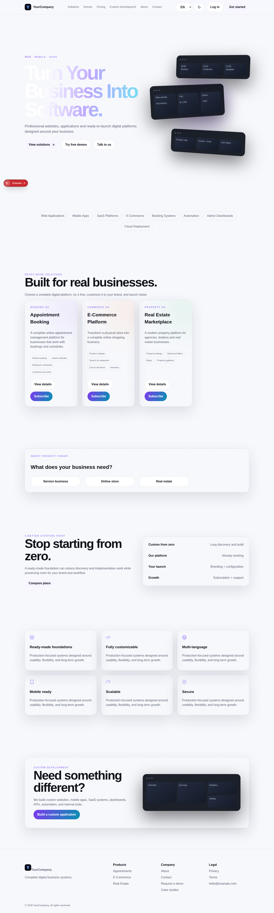

---

## The problem I set out to solve

Small businesses often need similar digital capabilities—commerce, bookings, delivery coordination, customer accounts, dashboards, and administration—but custom development repeatedly starts from zero. That creates duplicated engineering work, inconsistent quality, longer delivery times, and higher cost.

I designed this ecosystem around reusable product foundations. A prospective client can discover a solution, evaluate a safe demo, choose a plan, request customization, and manage the resulting service from one account. On the operational side, the platform owner can manage the catalog, clients, memberships, leads, support, content, and provisioning from one control plane.

The architecture deliberately keeps the product applications independently deployable. The Company Hub coordinates the commercial lifecycle without tightly coupling product runtimes or databases.

## My role and ownership

My contribution covers the responsibilities of a full-stack product engineer:

- Translated broad business ideas into actors, use cases, workflows, state transitions, and delivery stages.
- Designed public, authenticated, operator, and administrator experiences.
- Implemented responsive and multilingual interfaces across five applications.
- Designed database models and service boundaries for accounts, subscriptions, entitlements, provisioning, support, commerce, property, delivery, and appointments.
- Applied role-based authorization and tenant-aware access patterns.
- Created safe demo adapters for payments and browser-persisted presentation data.
- Structured production-facing integrations behind provider boundaries.
- Evaluated technical maturity honestly and produced a risk-based delivery roadmap.

---

## System architecture

The Company Hub acts as the commercial and operational control plane. Each product remains a separate deployment with its own domain model and runtime.

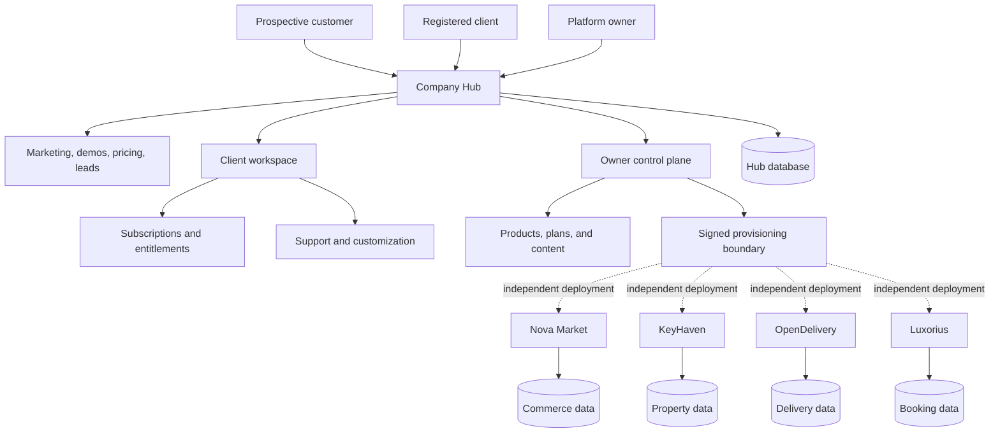

### Why I chose this structure

- **Independent deployment:** A failure or release in one product does not require deploying every application.
- **Clear ownership:** The Hub owns commercial relationships; each product owns its operational data.
- **Reduced coupling:** Provisioning and launch access use explicit boundaries instead of importing product code into the Hub.
- **Reusable commercial layer:** New products can join the catalog without rebuilding subscriptions, leads, support, or client administration.
- **Safer demonstrations:** Demo environments can be reset or isolated without affecting commercial account records.

### Technology map

| Application | Primary stack | Architectural purpose |
|---|---|---|
| Company Hub | Next.js, React, Prisma, PostgreSQL-compatible local development, Better Auth | Marketing, accounts, catalog, memberships, entitlements, provisioning, support, and administration |
| Nova Market | React, TypeScript, Vite, Capacitor, Express/PostgreSQL production adapter | Storefront, checkout, customer orders, store operations, and mobile packaging |
| KeyHaven | React, TypeScript, Vite, Express/PostgreSQL production adapter | Listings, search, inquiries, reservations, agent workflows, and marketplace administration |
| OpenDelivery | Next.js, React, Prisma, PostgreSQL, Better Auth, Redis-compatible rate limiting | Multi-tenant courier marketplace and delivery-state coordination |
| Luxorius | React, Vite, Express, tenant-aware API integration | Appointment scheduling, customer approval, notifications, and tenant branding |

---

## Core use cases

### Use case 1: Product discovery to service provisioning

This is the central SaaS journey. It connects the marketing site to subscriptions, owner approval, entitlements, and product access.

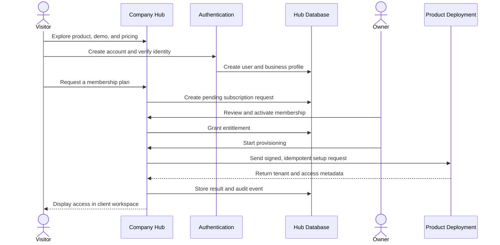

**What I implemented**

- Public product catalog, detailed product pages, demo center, and pricing.
- Account registration and database-backed authentication.
- Client dashboard for products, subscriptions, billing, requests, support, profile, and security.
- Owner controls for products, plans, demos, clients, memberships, leads, content, and activity.
- Manual membership activation for the payment-disabled stage.
- Provisioning state, external tenant metadata, entitlement checks, and audit-oriented records.

**Important design decision:** A successful browser redirect is never treated as proof of payment or entitlement. Access is controlled by verified server-side state.

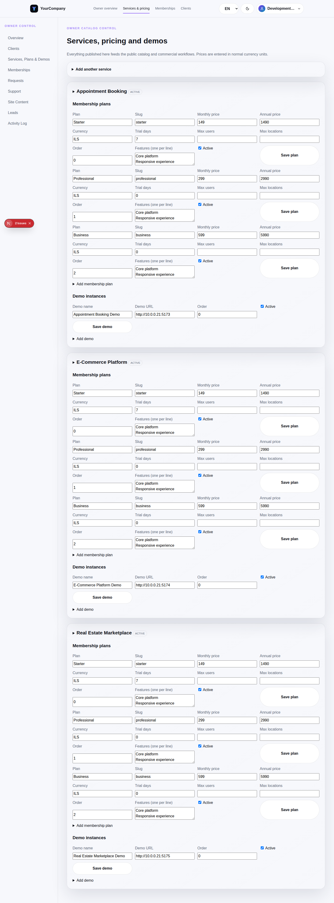

### Use case 2: E-commerce purchase and fulfillment

Nova Market demonstrates the complete customer-facing purchase path and the corresponding operator view.

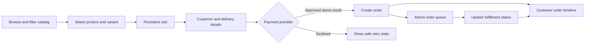

**What I implemented**

- Responsive merchandising homepage and product catalog.
- Search, category and price filters, sorting, and empty-result behavior.
- Product variants, quantity selection, wishlist, cart, and totals.
- Multi-step checkout with a payment-provider abstraction.
- Customer order history and fulfillment timeline.
- Admin metrics, order management, and status transitions.
- Mobile navigation and Capacitor project shells.

**Current boundary:** The polished demo uses sample catalog/order data and local persistence. A production API and customer portal boundary exist, but inventory, payments, fulfillment, and every admin module still require end-to-end production integration.

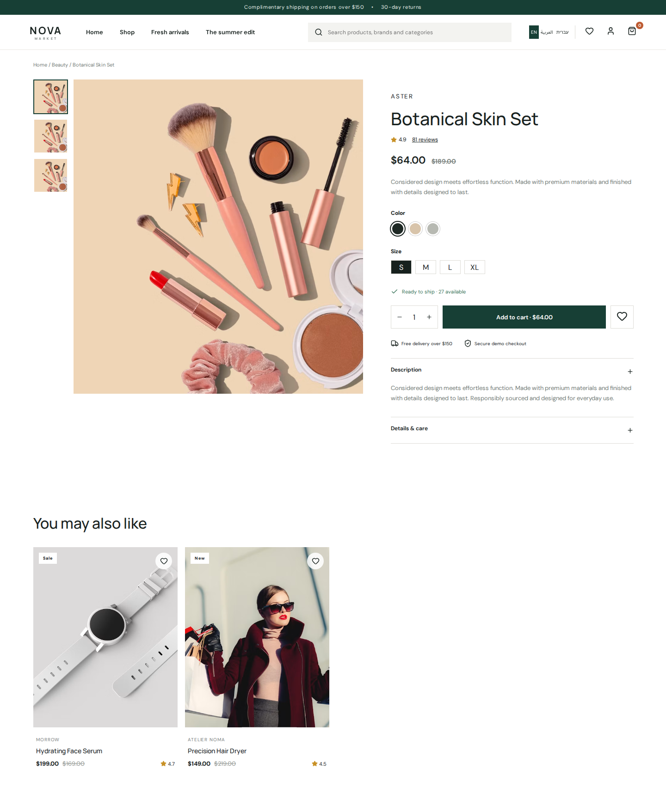

### Use case 3: Property discovery and lead conversion

KeyHaven connects property search to saved items, inquiry capture, viewing requests, and an agent/admin workspace.

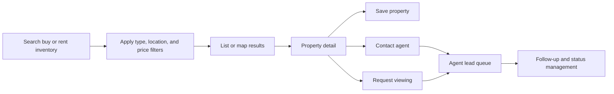

**What I implemented**

- Multilingual property discovery in English, Arabic, and Hebrew.
- Buy/rent modes, text search, type filtering, sorting, list/map presentation, and favorites.
- Rich property detail with gallery, facts, amenities, mortgage estimate, related inventory, and agent actions.
- Inquiry and viewing-request forms.
- Clearly labeled simulated reservation-payment flow.
- Role-oriented demo entry and agent/admin dashboard direction.

**Current boundary:** Search and the visual map operate on curated demo data. Production work includes persistent listing management, geospatial search, media processing, CRM workflows, and a legal decision on reservation payments.

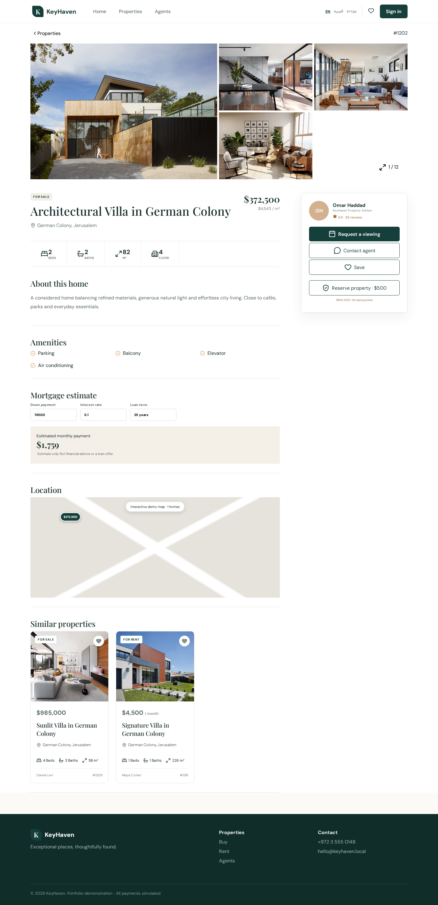

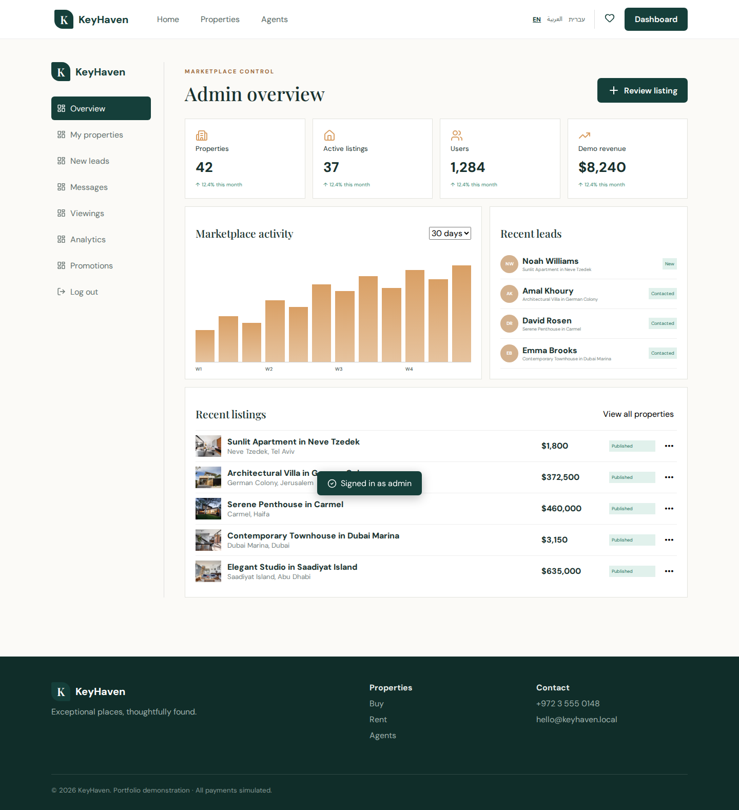

### Use case 4: Independent courier opportunity lifecycle

OpenDelivery is modeled as a marketplace where businesses publish opportunities and independent couriers choose whether to accept or make an offer. The platform does not hold delivery funds.

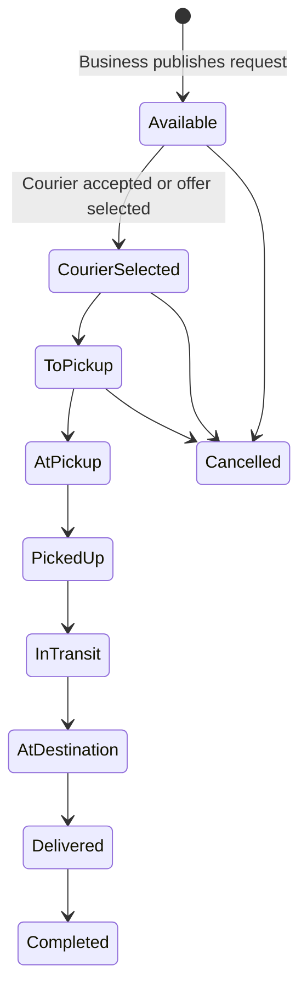

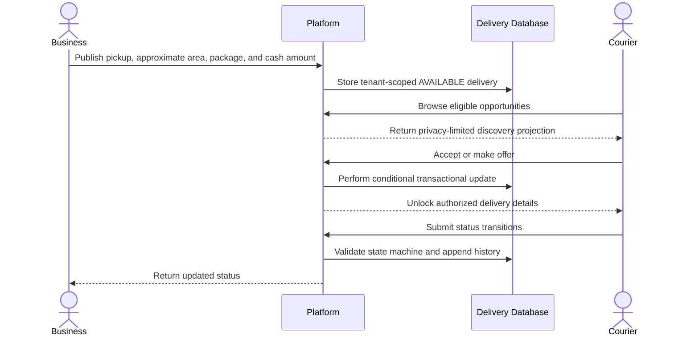

**What I implemented**

- Separate business and courier onboarding paths.
- Tenant-scoped business, courier, delivery, offer, service-area, category, report, and status-history models.
- Explicit delivery-state rules and atomic selection concepts.
- Privacy-limited opportunity discovery before courier selection.
- Business, courier, settings, new-delivery, and administration route foundations.
- Direct-cash marketplace positioning with no wallet, escrow, or money-transfer behavior.

**Current boundary:** The domain and backend foundation is stronger than the current authenticated UI coverage. The next milestone is a reliable seeded environment and complete validation of the business/courier lifecycle with realtime updates, maps, notifications, moderation, and mobile-first operation.

### Use case 5: Appointment booking and tenant customization

Luxorius targets appointment-based businesses that need customer access, schedule management, user approval, reminders, and configurable branding.

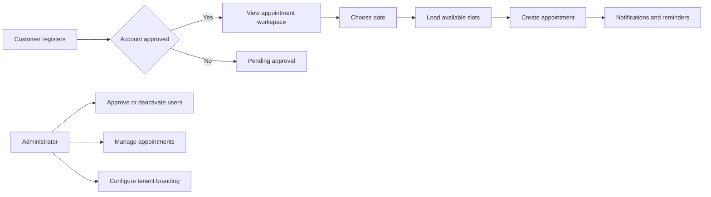

**What I implemented**

- Multilingual login and registration experience.
- Token-protected appointment, user-administration, and settings routes.
- Role-aware appointment details and customer contact actions.
- Date generation, availability loading, busyness indicators, and booking interaction.
- Bulk customer activation/deactivation.
- Tenant-aware shop name, color, surface, and background configuration.
- PWA install and push-notification foundations.

**Current boundary:** The frontend-to-backend integration needs stabilization and a dependable seeded demo. The highest-priority work is service/staff scheduling, conflict protection, reliable reminder delivery, better disconnected states, and deployment hardening.

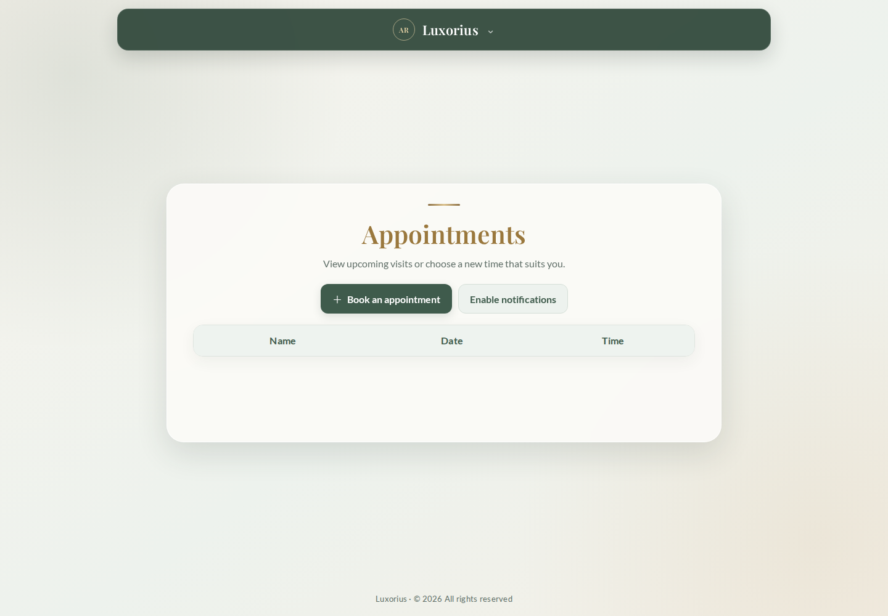

---

## Data and trust boundaries

I separated data by domain and avoided treating the central platform as a shared database for every product.

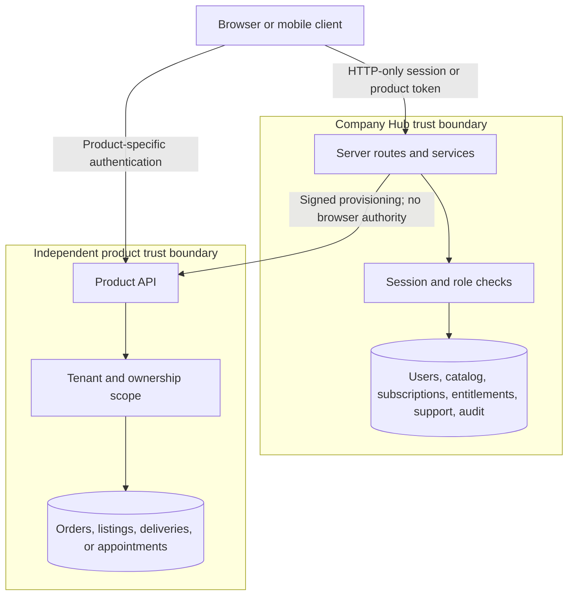

### Security decisions represented in the implementation

- Authorization decisions are performed server-side for protected Hub operations.
- Client-owned queries are scoped to the authenticated user rather than a browser-provided owner ID.
- Administrative and customer workspaces use separate authorization checks.
- OpenDelivery’s major queries are tenant-scoped and exact destination/contact details are excluded from discovery projections.
- Subscription and provisioning flows use explicit server state rather than trusting success URLs.
- Payment behavior is abstracted and demo payments are labeled as simulated.
- Destructive business records are generally archived or deactivated to preserve history.
- Sensitive integrations are designed around server-only secrets and signed requests.

### Production security work I would complete

- External security review and threat modeling.
- Distributed rate limiting and abuse protection at public boundaries.
- Multi-factor authentication and active-session management where appropriate.
- Production email verification and recovery testing.
- Private object storage, signed uploads, file validation, and malware scanning.
- Centralized security logging, alerting, and incident-response procedures.
- Jurisdiction-specific privacy, marketplace, commerce, and retention review.

---

## Engineering decisions and tradeoffs

### Independent products instead of a monolith

I kept each product independently deployable because release cadence, operational data, infrastructure, and failure modes differ. The tradeoff is duplicated project configuration and more deployment surfaces. The benefit is clearer domain ownership and the ability to sell, customize, or deploy a product independently.

### Provider abstractions for incomplete external integrations

Payments, email, provisioning, native capabilities, and persistence use explicit boundaries. This let me build and test workflows before choosing final vendors. The tradeoff is additional adapter work; the benefit is avoiding vendor-specific logic throughout the UI and business services.

### Safe demos instead of pretending every service is live

Nova Market and KeyHaven use local/demo state for several workflows, and simulated payments are explicitly labeled. This makes the portfolio reviewable without false claims about transactions or customers. The next step is replacing adapters one capability at a time while preserving their contracts.

### Multilingual design at the architecture stage

I treated English, Arabic, and Hebrew as layout requirements rather than simple text replacement. Directionality, navigation, responsive behavior, and localized labels were designed together. Remaining work includes professional translation review and complete localization of backend validation and transactional messages.

### Manual activation before automated billing

The Company Hub supports a payment-disabled phase in which an owner explicitly activates a membership. This prevents an incomplete billing integration from granting access. A future payment adapter can automate activation only after a verified and idempotently processed provider event.

---

## Current maturity

| Product | Current stage | Evidence | Main gap |
|---|---|---|---|
| Company Hub | Functional MVP / pre-production | Database-backed authentication, seeded client/admin journeys, subscriptions, support, catalog, and provisioning state | Final brand and production providers for payments, email, storage, monitoring, and provisioning |
| Nova Market | Polished interactive demo / frontend MVP | Complete storefront, cart, checkout, customer orders, admin overview, responsive and mobile-oriented UI | Persistent production integration across catalog, inventory, payment, fulfillment, and admin modules |
| KeyHaven | Polished interactive demo / frontend MVP | Search, filters, property detail, leads, simulated reservation, localization, and role dashboard | Persistent listings, real maps/geospatial search, CRM completion, media pipeline, and production authentication |
| OpenDelivery | Backend-led early MVP | Tenant-aware schema, role onboarding, state machine, privacy projections, transactional workflow design, and route foundations | End-to-end authenticated UI validation and infrastructure-backed realtime operations |
| Luxorius | Early integrated MVP | Authentication UI, protected scheduling, user administration, theme settings, and notification/PWA foundations | Stable backend integration, complete booking rules, reliable demo data, and operational hardening |

### What production-ready would require

I would not define readiness by visual completeness. For a selected product, I would require:

- Tested critical journeys across supported roles and devices.
- Production authentication, email, storage, monitoring, and backup integrations.
- Validated authorization and tenant isolation.
- Migration, rollback, recovery, and incident procedures.
- Accessibility and performance targets.
- Load, concurrency, failure, and idempotency testing.
- Privacy, retention, legal, and payment review for the target jurisdiction.
- Operational dashboards, alerts, support procedures, and clear ownership.

---

## Delivery roadmap

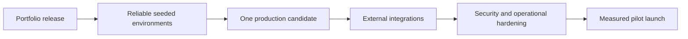

### Phase 1: Portfolio release

- Replace temporary branding and contact information.
- Deploy stable demos with synthetic data and reset behavior.
- Remove visible development warnings and disconnected presentation states.
- Add a concise video walkthrough and links to live environments.
- Complete accessibility, responsive, browser, and performance review.

### Phase 2: Reproducible MVP environments

- Provide a reliable start, migrate, and seed workflow for every product.
- Add end-to-end tests for one critical journey per role.
- Standardize loading, empty, error, unauthorized, and offline states.
- Add health checks, structured logs, error monitoring, and backup verification.

### Phase 3: Select one production candidate

I would avoid trying to commercialize every product simultaneously. I would select the application with the strongest validated customer demand, complete its critical workflow, and use the Company Hub as its commercial and support layer.

### Phase 4: Production integrations and assurance

- Connect only the providers required by the selected product.
- Validate payment, email, storage, realtime, maps, or notification workflows as applicable.
- Perform threat modeling, concurrency tests, data-retention review, backup restoration, and deployment rollback exercises.
- Launch with a controlled pilot and measure real usage before expanding the feature surface.

---

## What this project demonstrates to an engineering team

- I can move from an ambiguous business idea to explicit actors, use cases, data ownership, and delivery stages.
- I can work across frontend, backend, data modeling, authentication, and operational concerns.
- I understand that product administration and failure recovery matter as much as the happy-path customer interface.
- I can design multilingual and RTL experiences as first-class requirements.
- I can use domain boundaries and provider abstractions to manage complexity and incomplete vendor decisions.
- I distinguish a visual prototype, a functional MVP, and production-ready software.
- I document limitations and technical debt instead of hiding them behind polished screenshots.
- I can prioritize a credible path from portfolio demonstration to measured production delivery.

## Repository guide

| Directory | Purpose |
|---|---|
| `company-website/` | Central commercial hub, client workspace, owner administration, and SaaS control plane |
| `e-commerce/` | Nova Market storefront, customer journey, admin experience, API, and mobile shells |
| `realEstate/` | KeyHaven property marketplace and server adapter |
| `openDelivery/` | Multi-tenant independent courier marketplace |
| `luxorios-barbershop/` | Appointment-management frontend and backend |
| `portfolio-user-guide/screenshots/` | Curated evidence used by this case study |

## Closing statement

This project represents how I approach full-stack product engineering: define the business problem, model the actors and state, establish trust boundaries, design both customer and operator experiences, implement the core workflows, and remain precise about what still separates an MVP from dependable production software.

I would welcome the opportunity to discuss the architecture, product decisions, tradeoffs, implementation challenges, and roadmap in an interview.
